# 24 Fall Application

## Zen of Application

> Don't worry about it. There is nothing you can do about it at this point and they will tell you their decision when they reach it. Try and stop refreshing the status and do something that isn't about this.

## Conclusion

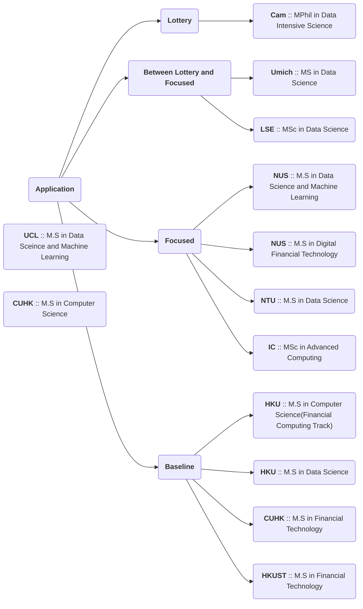

### Lottery
* Cambridge :: MPhil in Data Intensive Science

### Between Lottery and Focused
* ~~Cornell :: M.Eng in ECE;~~
* LSE :: MSc in Data Science
* Umich :: MS in Data Science

### Focused

* National University of Singapore :: M.S in Data Science and Machine Learning;
* National University of Singapore :: M.S in Digital Financial Technology;
* Nanyang Technological University :: M.S in Data Science;
* Imperial Colledge London :: MSc in Computing

### Baseline
* Hong Kong University :: M.S in Computer Science(Financial Computing Track)
* Hong Kong University :: M.S in Data Science
* ~~Chinese University of Hong Kong :: M.S in Computer Science;~~
* Chinese University of Hong Kong :: M.S in Financial Technology;
* Hong Kong University of Science and Technology :: M.S in Financial Technology

## Singapore

### National University of Singapore

#### MS in Data Science and Machine Learning

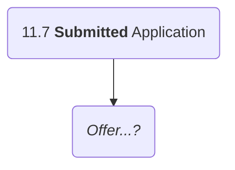

#### MS in Digital Financial Technology

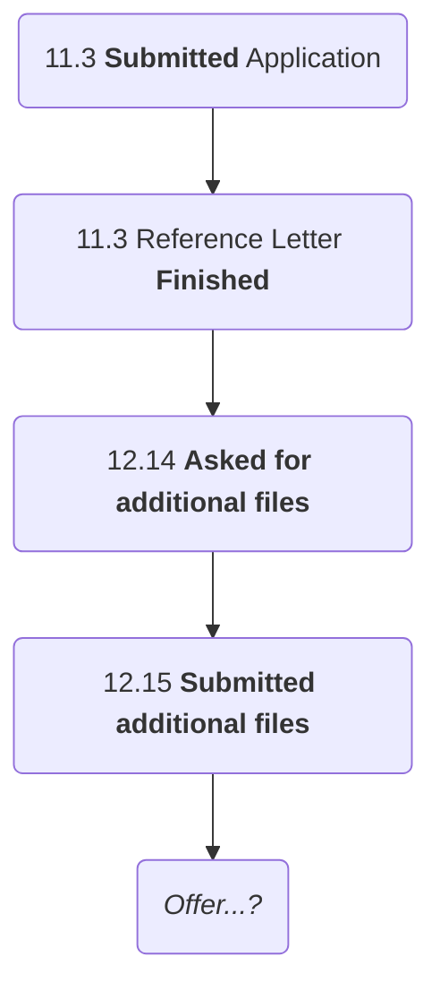

#### MComp in Computer Science (Planning...)

[MComp - Computer Science Specialisation](https://scale.nus.edu.sg/programmes/graduate/master-of-computing/mcomp---computer-science-specialisation)

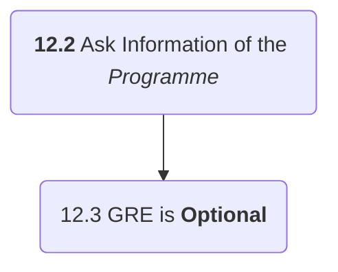

### Nanyang Technological University

#### MS in Data Science

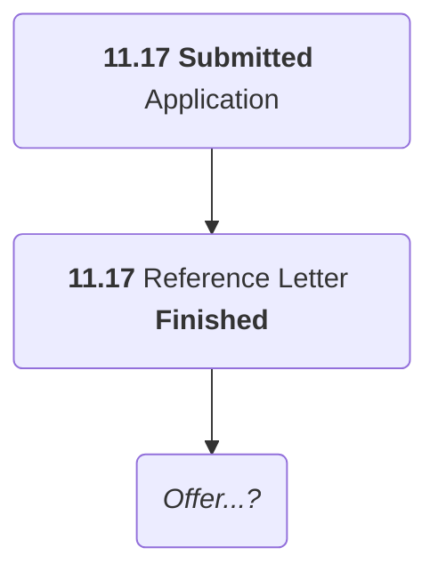
## UK

### Cambridge University

#### MPhil in Data Intensive Science
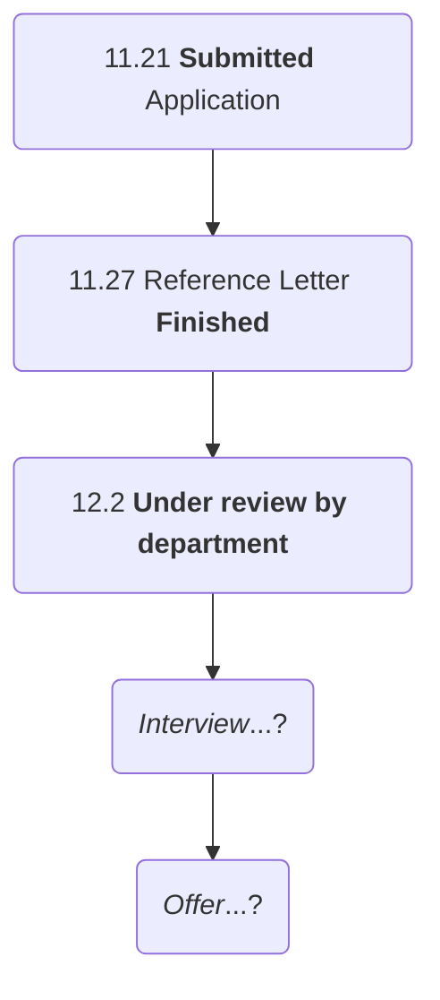

:::success
Please... Kindly Give Me An Interview!

More or less an offer!
:::

### Imperial Colledge London

#### MSc in Advanced Computer Science

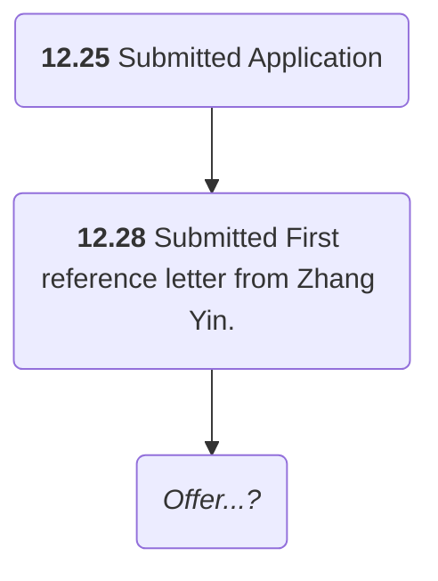

### London School of Economics and Political Science

#### MSc in Data Science

[MSc Data Science](https://www.lse.ac.uk/study-at-lse/Graduate/degree-programmes-2024/MSc-Data-Science)

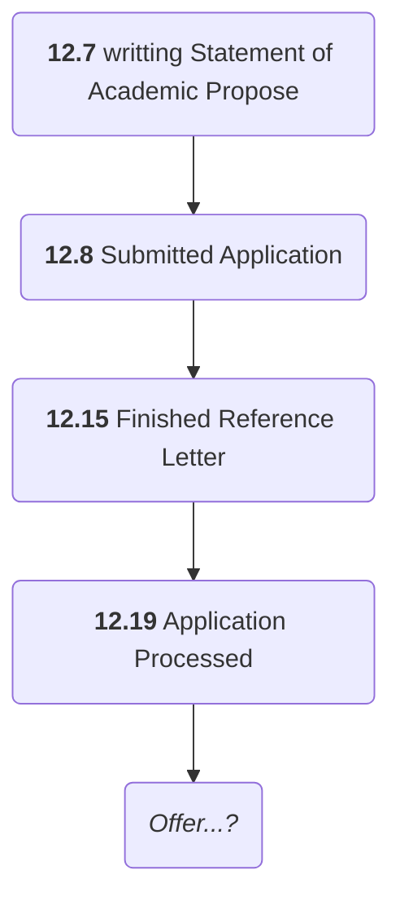

## Hong Kong

### Hong Kong University

#### MS in Computer Science (Financial Computing Track)

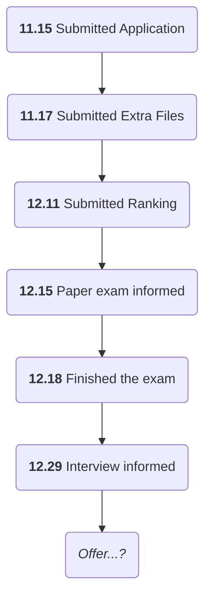

<!-- :::info
* 11.15 **Submitted** Application;
* *Interview...?*
::: -->

#### MS in Data Science

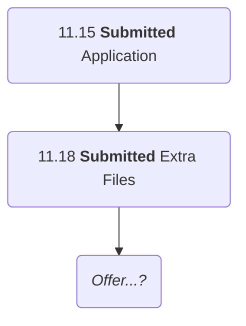

<!-- :::info
* 11.15 **Submitted** Application;
* *Interview...?*
::: -->

### Chinese University Hong Kong

#### MSc in Financial Technology

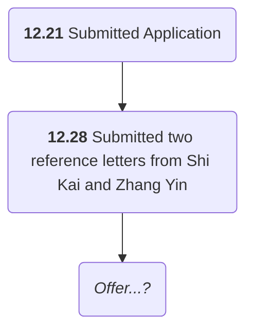

### Hong Kong University of Science and Technology

#### MSc in Financial Technology
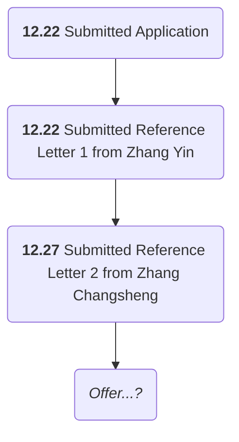

## US

### University of Michigan

#### M.S in Data Science

[M.S. in Data Science](https://lsa.umich.edu/stats/masters_students/mastersprograms/data-science-masters-program.html)

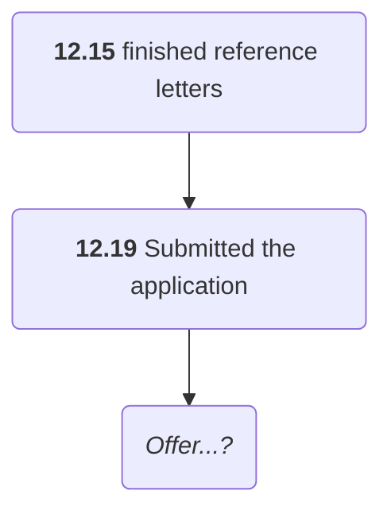
