# 24 Fall Application

## Conclusion

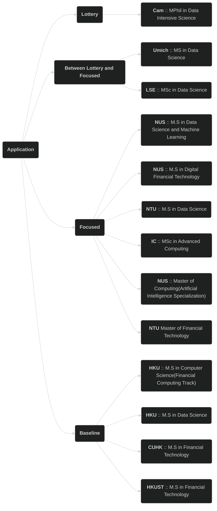

### Lottery
* Cambridge :: MPhil in Data Intensive Science ❌

### Between Lottery and Focused

* LSE :: MSc in Data Science ❌
* Umich :: MS in Data Science ❌

### Focused

* National University of Singapore :: M.S in Data Science and Machine Learning ❌
* National University of Singapore :: M.S in Digital Financial Technology ❌
* National University of Singapore :: M.Comp (Artificial Intelligence Specialization) ❓
* Nanyang Technological University :: M.S in Data Science ✅
* Nanyang Technological University :: M.S in Financial Technology ❌
* Imperial Colledge London :: MSc in Advanced Computing ❌
* Hong Kong University :: M.S in Data Science ❌

### Baseline
* Hong Kong University :: M.S in Computer Science(Financial Computing Track) ✅
* Chinese University of Hong Kong :: M.S in Financial Technology ✅
* Hong Kong University of Science and Technology :: M.S in Financial Technology ❓

## Singapore

### National University of Singapore

#### MS in Data Science and Machine Learning

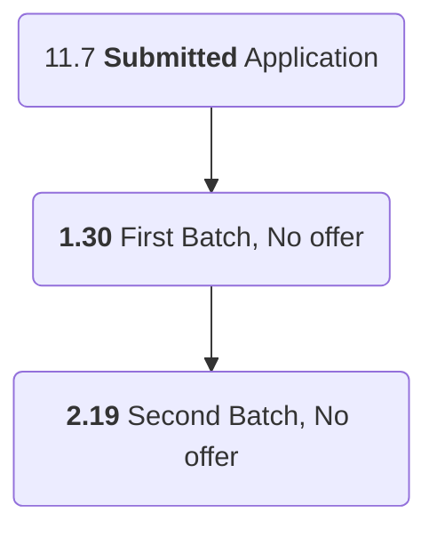

#### MS in Digital Financial Technology

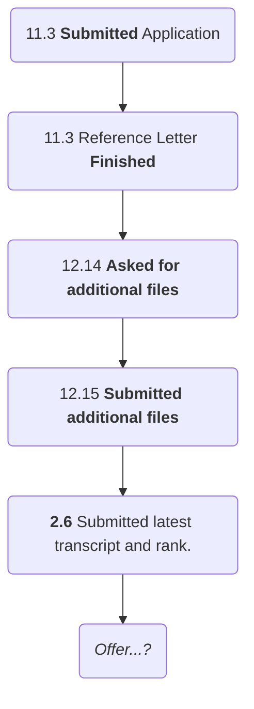

#### MComp in Computer Science

[MComp - Computer Science Specialisation(AI)](https://scale.nus.edu.sg/programmes/graduate/master-of-computing/mcomp---computer-science-specialisation)

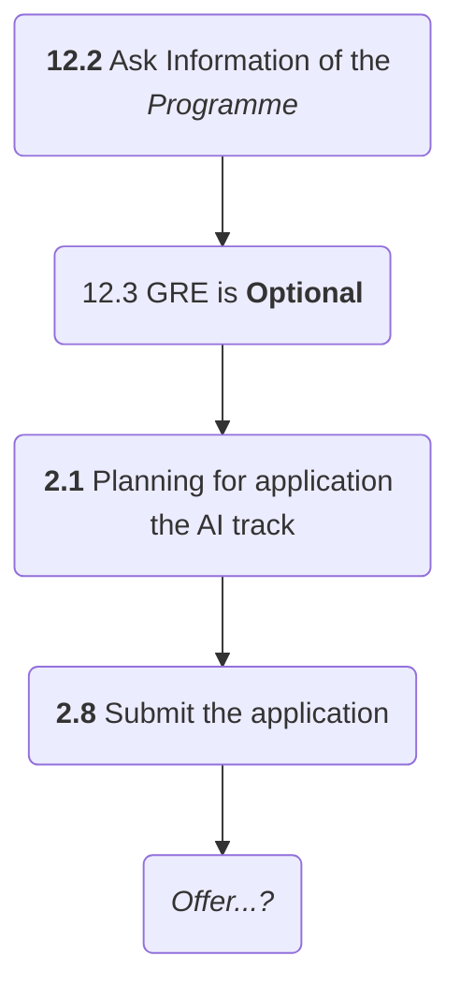

### Nanyang Technological University

#### MS in Data Science

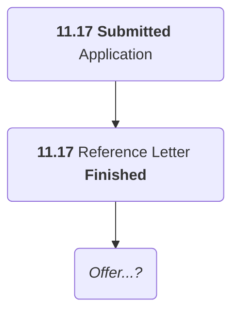

#### M.S in Financial Technology

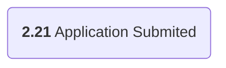

## UK

### Cambridge University

#### MPhil in Data Intensive Science
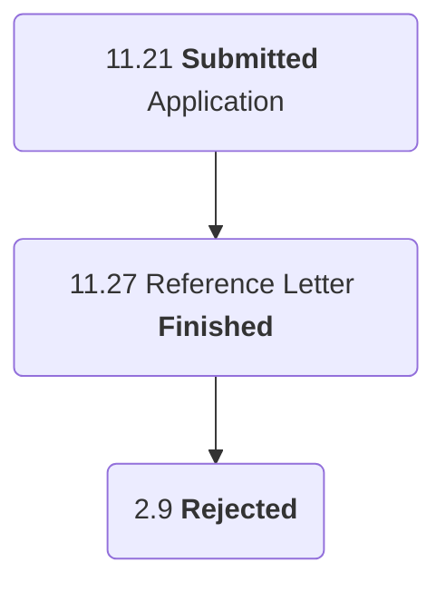

### Imperial Colledge London

#### MSc in Advanced Computing

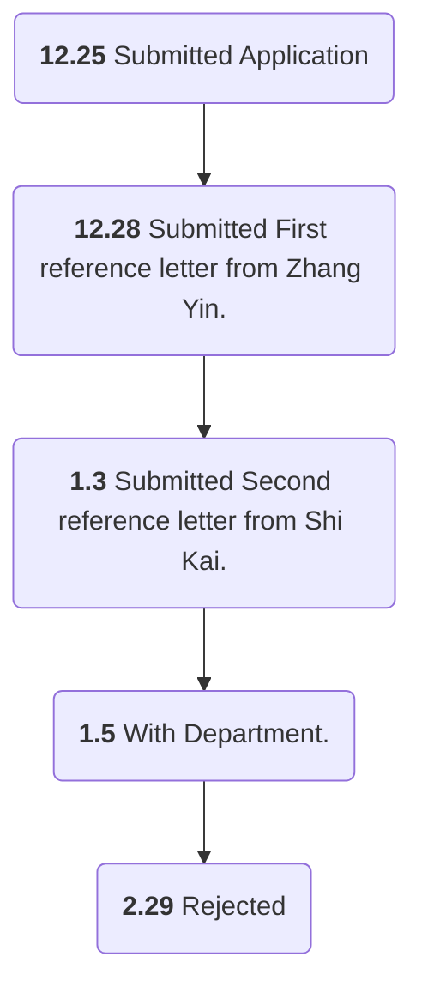

### London School of Economics and Political Science

#### MSc in Data Science

[MSc Data Science](https://www.lse.ac.uk/study-at-lse/Graduate/degree-programmes-2024/MSc-Data-Science)

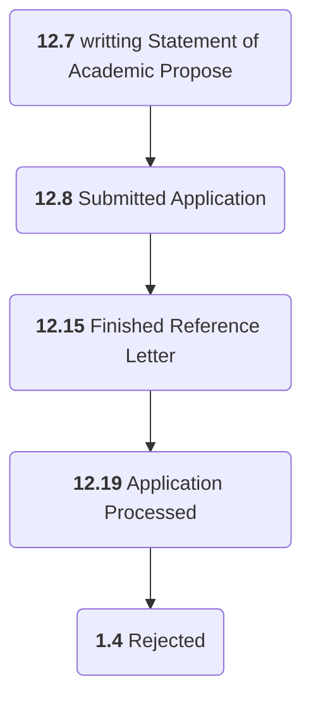

## Hong Kong

### Hong Kong University

#### MS in Computer Science (Financial Computing Track)

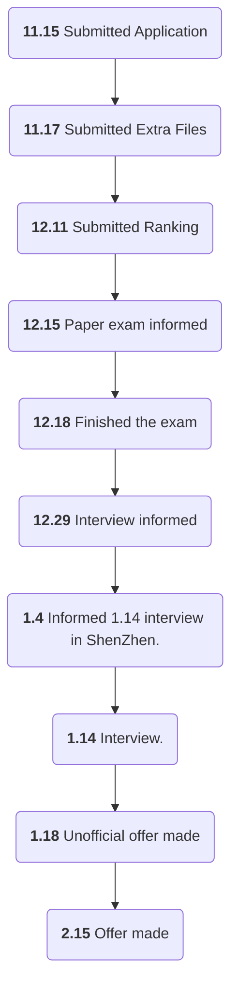

<!-- :::info
* 11.15 **Submitted** Application;
* *Interview...?*
::: -->

#### MS in Data Science

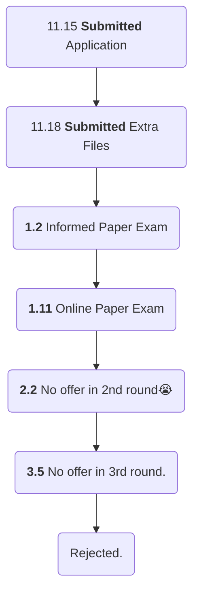

<!-- :::info
* 11.15 **Submitted** Application;
* *Interview...?*
::: -->

### Chinese University Hong Kong

#### MSc in Financial Technology

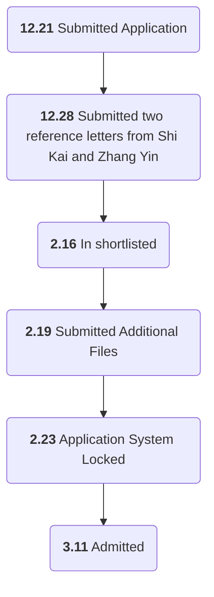

### Hong Kong University of Science and Technology

#### MSc in Financial Technology
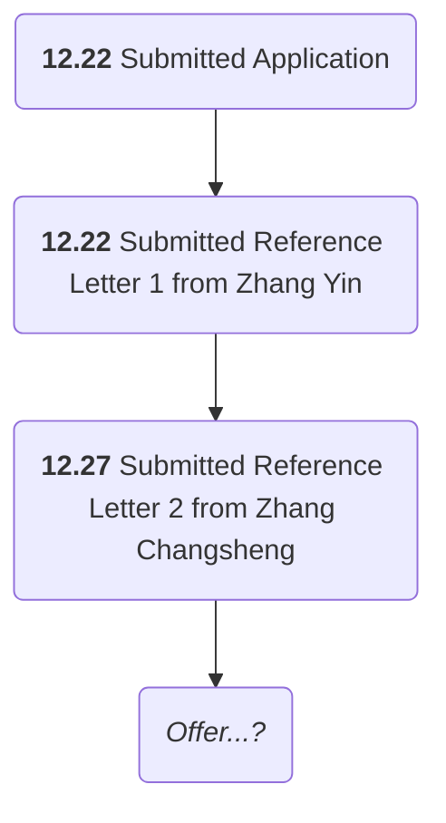

## US

### University of Michigan

#### M.S in Data Science

[M.S. in Data Science](https://lsa.umich.edu/stats/masters_students/mastersprograms/data-science-masters-program.html)

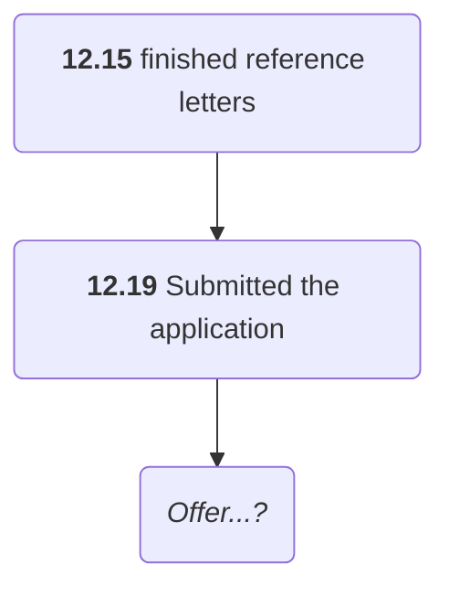
