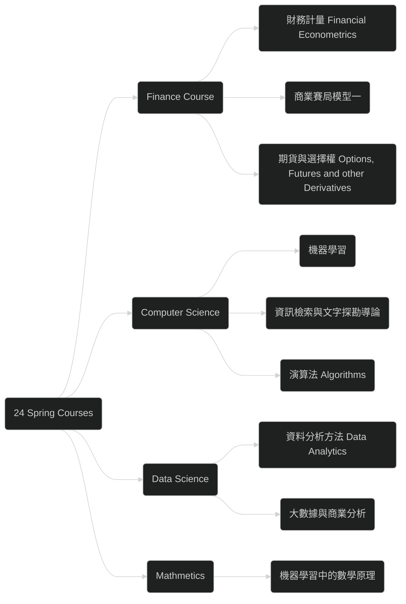

# 2024 Spring Semester Planned Taking Course

This is the last semester in Northeastern University. Just to take this nots to `remind` myself what I want to learn, and who I want to be.

## Overview

## Finance and Economics Course 

Just follow my personal interest. I shall always take several finance & economics course.

### 商業賽局模型一 ( Fin 7035 )

#### Information

> * Course Name: 商業賽局模型一 
> * Lecturer: 陳其美
> * Semester: 110-1
> * NTU Cool Link: [商業賽局模型一 ( Fin 7035 )](https://cool.ntu.edu.tw/courses/7971)
>
> {: .prompt-info }

#### Syllabus

> * 9/20 Static Games with Complete Information, I 
> * 9/27 Static Games with Complete Information, II 
> * 10/4 Multistage Games with Observable Actions and Repeated Games 
> * 10/11 Static Games with Incomplete Information 
> * 10/18 Adverse Selection and Screening Games, Part I 
> * 10/25 Adverse Selection and Screening Games, Part II 
> * 11/1 Signaling Games, Perfect Bayesian Equilibrium, and Some Refinements, I 
> * 11/8 Signaling Games, Perfect Bayesian Equilibrium, and Some Refinements, II 
> * 11/15 Midterm Exam 
> * 11/22 Financial Signaling Models, I 
> * 11/29 Financial Signaling Models, II 
> * 12/6 Asset Trading Models, I 
> * 12/13 Asset Trading Models, II 
> * 12/20 Interactions between Financial and Product Markets 
> * 12/27 Pricing Strategies 
> * 1/3 Product Line Design, Branding and Return Policy 
> * 1/10 Distribution Channels and E-commerce 
> * 1/17 Oral Presentation
>
> {: .prompt-tip }

#### Timeline

To be continue.

### 財務計量 ( Financial Econometrics,  Fin 3026 )

#### Information

> * Course Name: 財務計量 ( Financial Econometrics )
> * Lecturer: Chih-Ching Hung
> * Semester: 110-2
> * NTU Cool Link: [財務計量 (Fin 3026) ](https://cool.ntu.edu.tw/courses/13240)
>
> {: .prompt-info }

#### Syllabus

> * Week 1	2/14	Basic Regression Concepts
> * Week 2	2/21	Basic Regression Concepts
> * Week 3	2/28	Peace Memorial Day
> * Week 4	3/07	Time Series
> * Week 5	3/14	Time Series
> * Week 6	3/21	Time Series
> * Week 7	3/28	Time Series
> * Week 8	4/04	Spring Break
> * Week 9	4/11	Midterm Exam
> * Week 10	4/18	Exam Review and Potential Outcome Framework (1)
> * Week 11	4/25	Potential Outcome Framework (2)
> * Week 12	5/02	4~5 Student Presentations
> * Week 13	5/09	Matching, RCT, and Experiment (2 Presentations)
> * Week 14	5/16	Instrumental Variable (2 Presentations)
> * Week 15	5/23	Difference-in-Difference (2 Presentations)
> * Week 16	5/30	Regression Discontinuity (2 Presentations)
>
> {: .prompt-tip }

#### Timeline

To be continue.

### 期貨與選擇權 ( Options, Futures and other Derivatives )

> * Course Name: Options, Futures and other Derivatives
> * Lecturer: Chenghsi Hsieh
> * Semester: 111-2
> * Course Link: [Options, Futures, and Other Derivatives](https://www.youtube.com/watch?v=-WqSRu8U9mE&list=PL8xPPUJdubH7JP6bGMM9erZTbNdPXAOTT)
>
> {: .prompt-info }

#### Timeline

To be continue.

## Computer Science Course

And, for more understanding and techniques for Computer Science. I also register several Computer Science Course.

### 機器學習 ( EE5184 )

#### Information

> * Course Name: 機器學習 ( Machine Learning )
> * Lecturer: 李宏毅
> * Semester: 111-2
> * NTU Cool Link: [機器學習 ( EE5184 )](https://cool.ntu.edu.tw/courses/24108)
> * Course Website Link: [Machine Learning 2022 Spring](https://speech.ee.ntu.edu.tw/~hylee/ml/2022-spring.php)
>
> {: .prompt-info }

#### Syllabus

> * Lecture 1: Introduction of Deep Learning
> * Lecture 2: What to do if my network fails to train
> * Lecture 3: Image as input
> * Lecture 4: Sequence as input
> * Lecture 5: Sequence to sequence
> * Lecture 6: Generation, Recent Advance of Self-supervised learning for NLP
> * Lecture 7: Self-supervised learning for Speech and Image
> * Lecture 8: Auto-encoder / Anomaly Detection
> * Lecture 9: Explainable AI
> * Lecture 10: Attack
> * Lecture 11: Adaptation	
> * Lecture 12: Reinforcement Learning
> * Lecture 13: Network Compression
> * Lecture 14: Life-long Learning
> * Lecture 15: Meta Learning
>
> {: .prompt-tip }

#### Timeline

To be continue.

### 資訊檢索與文字探勘導論 ( IM 5030 )

#### Information

> * Course Name: 資訊檢索與文字探勘導論
> * Lecturer: 陳建錦
> * Semester: 112-1
> * NTU Cool Link: [資訊檢索與文字探勘導論 ( IM 5030 )](https://cool.ntu.edu.tw/courses/28999)
>
> {: .prompt-info }

#### Syllabus

> 
>
> {: .prompt-tip }

#### Timeline

To be continue.

### 演算法 ( Algorithms, EE4033-01 )

#### Information

> * Course Name: 演算法 ( Algorithms )
> * Lecturer: 張耀文
> * Semester: 111-1
> * NTU Cool Link: [演算法 ( Algorithms )](https://cool.ntu.edu.tw/courses/20243)
>
> {: .prompt-info }

#### Syllabus

> Schedule (48 hrs in total this semester):
>
> 1. Mathematical foundations + administrative matters (6 hrs)
> 2. Sorting and order statistics (6 hrs)
> 3. Data structures: binary search trees, RB trees, interval trees (2-hr lecture **+ pre-recorded videos**)
> 4. Dynamic programming and greedy algorithms (9 hrs)
> 5. Amortized analysis (**pre-recorded videos**)
> 6. Graph algorithms: disjoint set, graph representations, searching, minimum spanning tree, single-source and all-pair shortest paths, network flow, matching (14 hrs)
> 7. NP-completeness & coping with NP-completeness (5 hrs)
> 8. General-purpose algorithms: simulated annealing, and machine learning, as time permits.
> 9. Others: Exams (6 hrs)
>
> {: .prompt-tip }

#### Timeline

To be continue.

## Data Science

My interest is also `data science`.  Here are several Course I decided to learn.

### 資料分析方法 ( Data Analytics， IE5054 )

#### Information

> * Course Name: 資料分析方法 ( Data Analytics )
> * Lecturer: CHUN-HUNG LAN
> * Semester: 112-2
> * NTU Cool Link: [資料分析方法 ( Data Analytics )](https://cool.ntu.edu.tw/courses/35000)
>
> {: .prompt-info }

#### Syllabus

> |  Week   |   Due   |                  Topic                   |
> | :-----: | :-----: | :--------------------------------------: |
> | Week 1  | Feb. 19 |             Review & Preview             |
> | Week 2  | Feb. 26 |           Regression Analysis            |
> | Week 3  | Mar. 04 |           Regression Analysis            |
> | Week 4  | Mar. 11 |    Multivariate Statistical Inference    |
> | Week 5  | Mar. 18 |      Dimension Reduction Techniques      |
> | Week 6  | Mar. 25 |     Partial Least Squares Regression     |
> | Week 7  | Apr. 01 | Big Data Infrastructure × Team Building* |
> | Week 8  | Apr. 08 |              Mid-term Exam               |
> | Week 9  | Apr. 15 |      Supervised Learning Algorithms      |
> | Week 10 | Apr. 22 |      Supervised Learning Algorithms      |
> | Week 11 | Apr. 29 |     Unsupervised Learning Algorithms     |
> | Week 12 | May 06  |     Unsupervised Learning Algorithms     |
> | Week 13 | May 13  |       Machine Learning Techniques        |
> | Week 14 | May 20  |             Deep Neural Nets             |
> | Week 15 | May 27  |             Deep Neural Nets             |
> | Week 16 | Jun. 03 | Project Presentation Day (Peer Review*)  |
> | Week 17 | Jun. 07 |                Report Due                |
>
> {: .prompt-tip }

#### Timeline

Just take the course `weekly`.

### 大數據與商業分析 (IM5047)

> * Course Name: 大數據與商業分析 ( IM5047 )
> * Lecturer:  楊立偉
> * Semester: 112-2
> * NTU Cool Link: [大數據與商業分析 ( IM5047 )](https://cool.ntu.edu.tw/courses/34447)
>
> {: .prompt-info }

#### Syllabus

> | 週次                      | 主題                                 | 投影片                                                       |
> | ------------------------- | ------------------------------------ | ------------------------------------------------------------ |
> | Week 01 (2024.02.21) 實體 | Introduction 課程及修課說明          | [簡介](https://homepage.ntu.edu.tw/~wyang/bda2024/slides/bda2024_intro.pdf) 之後請至[ntu cool](https://cool.ntu.edu.tw/courses/34447) |
> | Week 02 (2024.02.28) 放假 | L1: Text mining                      | 作業1                                                        |
> | Week 03 (2024.03.06) 線上 | L2: Web mining                       |                                                              |
> | Week 04 (2024.03.13) 實體 | L3: Classification                   |                                                              |
> | Week 05 (2024.03.20) 線上 | L4: Clustering                       |                                                              |
> | Week 06 (2024.03.27) 實體 | 期中專題說明                         |                                                              |
> | Week 07 (2024.04.03) 實體 | 實習/L5: Sequence Tagging            |                                                              |
> | Week 08 (2024.04.10) 線上 | L6: Language Processing              |                                                              |
> | Week 09 (2024.04.17) 線上 | Special Issue: Gen AI & applications |                                                              |
> | Week 10 (2024.04.24) 實體 | 期中報告                             |                                                              |
> | Week 11 (2024.05.01) 實體 | E-Commerce Analytics (1)             |                                                              |
> | Week 12 (2024.05.08) 實體 | E-Commerce Analytics (2)             | 期末專題說明                                                 |
> | Week 13 (2024.05.15) 線上 | E-Commerce Analytics (3)             |                                                              |
> | Week 14 (2024.05.22) 實體 | 期末Proposal/討論回饋                |                                                              |
> | Week 15 (2024.05.29) 線上 | Special Issue: Social Data Analytics |                                                              |
> | Week 16 (2024.06.05) 實體 | 期末報告                             |                                                              |
>
> {: .prompt-tip }

#### Timeline

Just take the course `weekly`.

## Mathematics

### 機器學習中的數學原理 ( COMME5051 )

#### Information

> * Course Name: 機器學習中的數學原理 ( COMME5051 )
> * Lecturer:  I-Hsiang Wang
> * Semester: 110-1
> * NTU Cool Link: [機器學習中的數學原理 ( COMME5051 )](https://cool.ntu.edu.tw/courses/9214)
>
> {: .prompt-info }

#### Syllabus

To be finished.

#### Timeline

To be finished.
